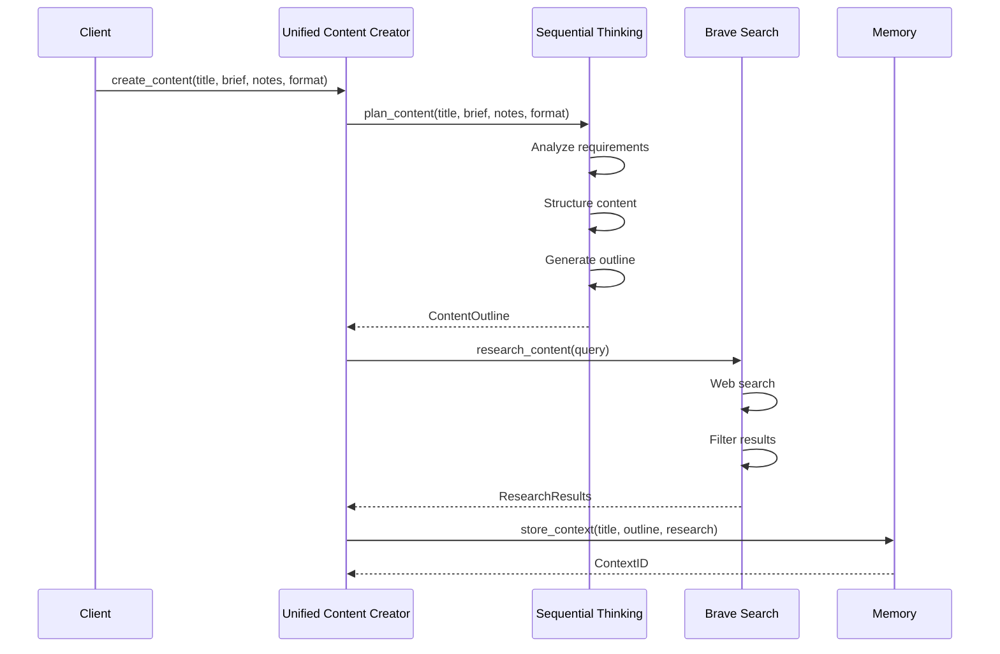
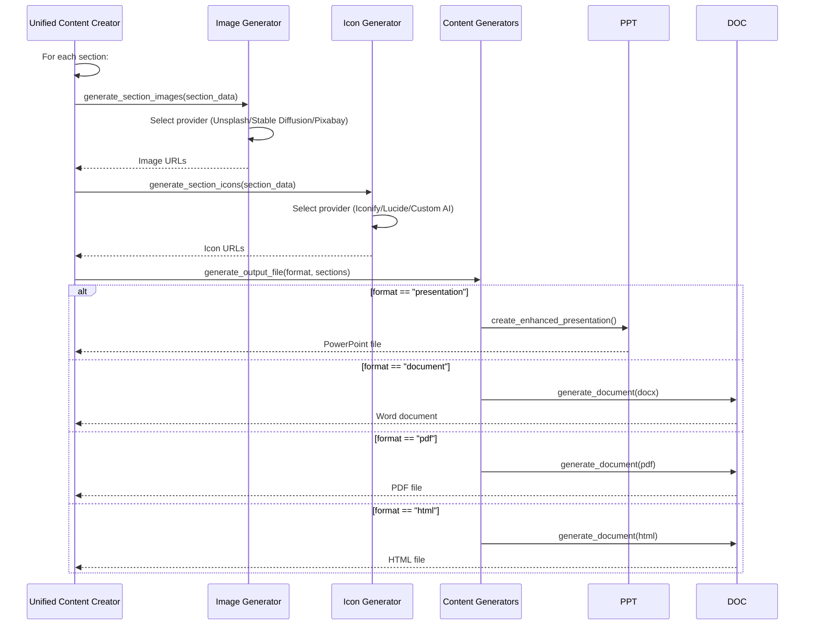
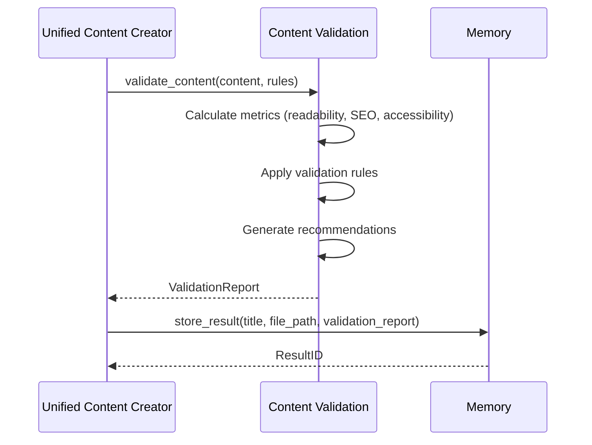

# 🏗️ Unified Content Creator System - Tool Architecture & Workflow

## 📊 System Architecture Overview



```mermaid
graph TB
    %% Main Entry Points
    Client[Client Application] --> REST[REST API Server]
    Client --> MCP[MCP Server Interface]
    
    %% REST API Layer
    REST --> UCC[Unified Content Creator]
    REST --> PPT[Enhanced PPT Generator]
    REST --> DOC[Enhanced Document Generator]
    REST --> IMG[Enhanced Image Generator]
    REST --> ICON[Enhanced Icon Generator]
    
    %% MCP Server Layer
    MCP --> ST[Sequential Thinking Server]
    MCP --> BS[Brave Search Server]
    MCP --> MEM[Memory Server]
    MCP --> FS[Filesystem Server]
    MCP --> RI[Research Integration]
    MCP --> CV[Content Validation]
    MCP --> AO[Advanced Orchestration]
    
    %% Content Generation Workflows
    UCC --> ST
    UCC --> BS
    UCC --> MEM
    UCC --> FS
    UCC --> PPT
    UCC --> DOC
    UCC --> IMG
    UCC --> ICON
    
    %% Enhanced Generators
    PPT --> LLM[LLM Integration]
    DOC --> LLM
    IMG --> LLM
    ICON --> LLM
    
    %% External APIs
    PPT --> PresentonAPI[Presenton API]
    IMG --> UnsplashAPI[Unsplash API]
    IMG --> StableDiffusion[Stable Diffusion]
    IMG --> PixabayAPI[Pixabay API]
    ICON --> IconifyAPI[Iconify API]
    ICON --> LucideAPI[Lucide Icons]
    
    %% Document Generation Backends
    DOC --> Pandoc[Pandoc Engine]
    DOC --> WeasyPrint[WeasyPrint Engine]
    DOC --> ReportLab[ReportLab Engine]
    DOC --> HTMLGen[HTML Generator]
    
    %% Output Formats
    PPT --> PPTX[PowerPoint Files]
    DOC --> DOCX[Word Documents]
    DOC --> PDF[PDF Files]
    DOC --> HTML[HTML Files]
    DOC --> MD[Markdown Files]
    DOC --> TEX[LaTeX Files]
    DOC --> RTF[RTF Files]
    
    %% Styling & Templates
    style UCC fill:#e1f5fe
    style ST fill:#f3e5f5
    style BS fill:#e8f5e8
    style MEM fill:#fff3e0
    style FS fill:#fce4ec
    style RI fill:#f1f8e9
    style CV fill:#e0f2f1
    style AO fill:#fafafa
```

## 🔄 Content Creation Workflow

### 1. **Content Planning Phase**


### 2. **Content Generation Phase**


### 3. **Quality Assurance Phase**


## 🛠️ Tool Integration Matrix

| Tool | Input Sources | Output Formats | Dependencies | Integration Points |
|------|---------------|----------------|--------------|-------------------|
| **Enhanced PPT Generator** | Notes, Brief, Style | .pptx | Presenton API, LLM | UCC, MCP Tools |
| **Enhanced Document Generator** | Content, Template | .docx, .pdf, .html, .md, .tex, .rtf | Pandoc, WeasyPrint, ReportLab | UCC, MCP Tools |
| **Enhanced Image Generator** | Query, Style, Format | .jpeg, .png, .webp, .svg | Unsplash, Stable Diffusion, Pixabay | UCC, Content Sections |
| **Enhanced Icon Generator** | Query, Style, Size | .svg, .png, .ico, .webp | Iconify, Lucide, Custom AI | UCC, Content Sections |
| **Sequential Thinking** | Title, Brief, Notes | Content Outline | LLM Models | UCC, Research Integration |
| **Brave Search** | Search Query | Web Results | Brave Search API | UCC, Research Integration |
| **Memory Server** | Content, Metadata | Stored Context | SQLite Database | All Tools |
| **Filesystem Server** | File Operations | File Paths | OS File System | All Tools |

## 🔗 MCP Server Integration

### **Sequential Thinking Server** (Port 3001)
- **Purpose**: AI-powered content planning and structuring
- **Input**: Content requirements, target format, style preferences
- **Output**: Structured content outline with sections, themes, and metadata
- **Integration**: Called by UCC for initial content planning

### **Brave Search Server** (Port 3002)
- **Purpose**: Web search and content research capabilities
- **Input**: Research queries, content type, filters
- **Output**: Relevant web content, statistics, case studies
- **Integration**: Called by UCC and Research Integration for content enhancement

### **Memory Server** (Port 3003)
- **Purpose**: Content storage, retrieval, and context management
- **Input**: Content data, metadata, search queries
- **Output**: Stored content, context retrieval, history
- **Integration**: Used by all tools for persistence and context

### **Filesystem Server** (Port 3004)
- **Purpose**: File operations and management
- **Input**: File paths, content, operations
- **Output**: File status, paths, metadata
- **Integration**: Used by all generators for file I/O

### **Image Generation Server** (Port 3005)
- **Purpose**: Multi-provider image generation
- **Input**: Image queries, style preferences, format requirements
- **Output**: Generated images, URLs, metadata
- **Integration**: Called by UCC for section image generation

### **Icon Generation Server** (Port 3006)
- **Purpose**: Multi-provider icon generation
- **Input**: Icon queries, style preferences, size requirements
- **Output**: Generated icons, URLs, metadata
- **Integration**: Called by UCC for section icon generation

## 📁 File Generation Workflows

### **HTML Generation Workflow**
```
1. Content Request → UCC
2. UCC → Sequential Thinking (Planning)
3. UCC → Brave Search (Research)
4. UCC → Enhanced Document Generator
5. Enhanced Document Generator → HTML Generator
6. HTML Generator → Template Selection
7. HTML Generator → Content Formatting
8. HTML Generator → TOC Generation
9. HTML Generator → File Output
10. UCC → Memory Server (Store Result)
```

### **Document Generation Workflow**
```
1. Content Request → UCC
2. UCC → Content Planning & Research
3. UCC → Enhanced Document Generator
4. Enhanced Document Generator → Pandoc (Primary)
5. If Pandoc fails → WeasyPrint (Fallback)
6. If WeasyPrint fails → ReportLab (Fallback)
7. Enhanced Document Generator → File Output
8. UCC → Memory Server (Store Result)
```

### **Presentation Generation Workflow**
```
1. Content Request → UCC
2. UCC → Content Planning & Research
3. UCC → Enhanced PPT Generator
4. Enhanced PPT Generator → LLM (Content Enhancement)
5. Enhanced PPT Generator → Presenton API
6. Enhanced PPT Generator → File Output
7. UCC → Memory Server (Store Result)
```

## 🎯 Key Integration Features

### **1. Seamless Format Switching**
- Single API call can generate multiple formats
- Automatic format detection and conversion
- Template consistency across formats

### **2. Intelligent Content Enhancement**
- AI-powered content planning
- Automated research integration
- Smart image and icon placement

### **3. Robust Fallback Mechanisms**
- Multiple generation engines per format
- Graceful degradation on failures
- Comprehensive error handling

### **4. Unified Content Management**
- Centralized content storage
- Context-aware content retrieval
- Version control and history tracking

### **5. Advanced Orchestration**
- Complex workflow management
- Conditional execution paths
- Parallel processing capabilities

## 🚀 Performance & Scalability

### **Parallel Processing**
- Image and icon generation in parallel
- Multiple document formats simultaneously
- Async/await throughout the system

### **Caching & Optimization**
- Template caching for HTML generation
- Research result caching
- Memory-based context retrieval

### **Resource Management**
- Efficient file I/O operations
- Memory usage optimization
- Background task management

## 🔒 Security & Validation

### **Input Validation**
- Content sanitization
- File type verification
- Size and format limits

### **Output Validation**
- Content quality assessment
- Accessibility compliance
- SEO optimization checks

### **Error Handling**
- Comprehensive error logging
- User-friendly error messages
- Graceful failure recovery

## 📈 Monitoring & Analytics

### **Performance Metrics**
- Generation time tracking
- Success/failure rates
- Resource usage monitoring

### **Content Analytics**
- Quality scores
- Usage patterns
- Popular templates and formats

### **System Health**
- MCP server status
- API response times
- Error rate monitoring

This architecture ensures that all tools work seamlessly together, providing a robust and scalable content creation platform that leverages the full capabilities of the MCP server ecosystem.
